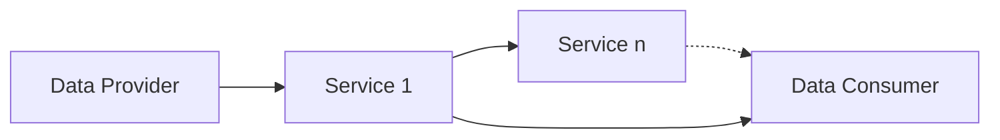
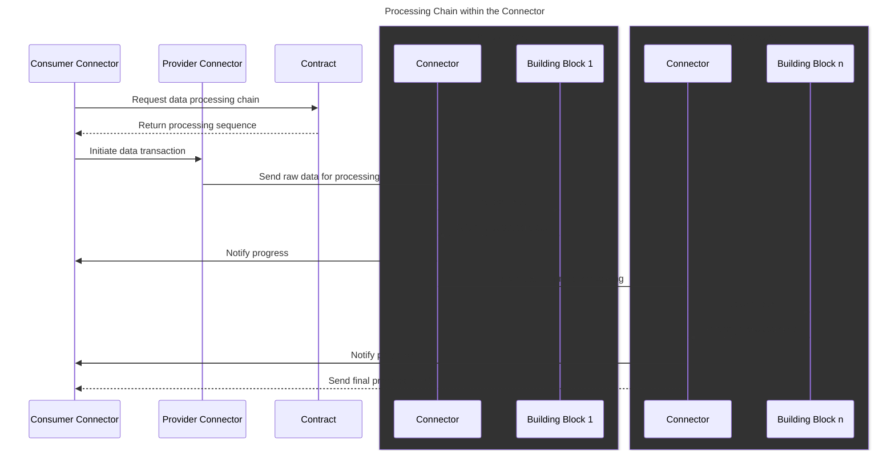

# Data Processing Chain Protocol

Specifications and augmentations needed to enable a dataspace-driven data exchange ecosystem where data flows through multiple dataspace enabling services. The term used here to represent that currently is Data Processing Chain.



## Infrastructure Services

A data processing service, as it acts as a data consumer and data provider, can be defined in a specific Service Offering that would be tagged as an “Infrastructure Service” and provide a Service Resource (for Input) & a Data Resource (for output). This is then represented as an Infrastructure Service-Tagged Service Offering.

An instance of a service needs to reference a Participant for the system to be aware of what participant is providing such service and which dataspace connector is going to be used by this data processing node whenever called by the data processing chain.

An infrastructure service:
- Can be considered both data consumer and data provider
- Can provide interoperability services
- Can provide tracking / monitoring services
- Can have specific requirements in the way it receives input data & information
- Can have parameters that should be provided to it on top of the data to configure the data processing

## Technical usage scenarios & Features

### Features/main functionalities

- Support for infrastructure services in the dataspace
- Creation and modification of data processing chains within data space use cases
- Support for management of a data processing chain within the data sharing protocol
- Provision of information for data processing within use case contracts


## The Data Processing Chain

The data processing chain represents the sequence of services the data should go through during the data transaction. It is the amount of nodes, represented as Infrastructure Service-Tagged Service Offerings.

### Technical usage scenarios

- It enables a dataspace-driven data transaction where multiple services can be included in the data transaction
- It defines the way an infrastructure service should be technically described in the dataspace
- It enables simple and easy configuration of which services should be used in an ecosystem and in what order

## Requirements

#### Data Processing Chain
- CAN be defined in a dataspace use case
- CAN be modified by a use case orchestrator
- MUST provide clear information to infrastructure services about the chain
- MUST be processed by dataspace connectors

#### Infrastructure Services
- SHOULD be defined in the catalogue
- SHOULD have a technical representation linked to a catalogue participant
- MUST be hosted and enabled by a participant
- MUST use a Dataspace Connector to handle data flow

#### Contracts
- MUST hold the data exchange flow information and from which to which infrastructure service the data should travel

## Integrations

### Direct Integrations with Other BBs

Interaction with other building blocks is essential to ensuring the functionalities of the Data Processing Chain. It is crucial to integrate the data processing chain chain into the contract, as this is where the chain will be stored. Additionally, integration with the catalogue is necessary to enable the creation and selection of the chain by participants.
- [Contract](https://github.com/Prometheus-X-association/contract-manager)
- [Catalogue](https://github.com/Prometheus-X-association/catalog-api)
- [Dataspace Connector](https://github.com/Prometheus-x-association/dataspace-connector)

### Integrations via Connector

The execution of the data processing chain primarily occurs through the connector. This component plays a central role in the process, orchestrating the data flow between the different nodes in the chain. The connector initiates each processing step, transmits data from one node to another, and ensures communication with the Consumer Connector to notify the progress of the process.

#### Data Processing Chain in between the provider & consumer connectors

- The data processing chain is external to the connectors of the Provider & Consumer and the contract holds the sequence information.
- The contract needs to state the flow of nodes to be called
- The contract needs to know the endpoints of the PDCs of the nodes involved
- PDCs need to know what index they represent in the flow / sequence (to calculate n+1 cursor)

>**N.B:** To notify the consumer of the progress of the data transaction, each node should ping the Consumer PDC on where it is in the chain. This enables the consumer to know if there was an issue in the chain.

## Relevant Standards

### Data Format Standards

- [JSON-LD](https://json-ld.org/) for schema definitions
- [ISO 3166-1 alpha-2](https://en.wikipedia.org/wiki/ISO_3166-1_alpha-2) for location country codes
- [ISO 8601](https://en.wikipedia.org/wiki/ISO_8601) for Date and time format


## Input / Output Data

The main entry of a data processing chain is the raw data coming from the data provider. The chain will then transform the data and transmit it to the consumer. Additionally, it will accept an arbitrary JSON payload, whose structure and attributes must be defined by the infrastructure service provider, to pass specific configuration to an infrastructure service when necessary.

Here's a potential example where the node expects date format specifications for input and output:

```json
{
  "dateFormat": {
    "inputFormat": "yyyy-MM-dd'T'HH:mm:ss'Z'",
    "outputFormat": "dd/MM/yyyy",
    "fields": [
      "createdAt",
      "updatedAt"
    ]
  }
}
```

## Architecture

#### 1. General Architecture
- The data processing chain is external to the provider and consumer connectors.
- The contract contains the information about the sequence of nodes.

#### 2. Configuration
- The orchestrator defines a fixed data processing chain for the ecosystem.
- This chain is used for all data transactions in the ecosystem.

#### 3. Contract
- The contract specifies the sequence of infrastructure service to be called.
- It contains the self-descriptions of the infrastructure service connectors involved.

#### 4. Infrastructure Services
- Each node is represented as a Service Offering tagged as "Infrastructure Service".
- Infrastructure services can contain both dataResource and softwareResource.
- Infrastructure services act as both data consumers and providers.
- Each infrastructure service is hosted into a data space connector handling data flow.

#### 5. Data Flow
- Data passes sequentially through the infrastructure services defined in the chain.
- Each infrastructure service connector processes the data and transmits it to the connector hosting the next infrastructure service.
- An infrastructure service Connector retrieves the contract to determine the sequence and identify the next infrastructure service.
- An infrastructure service Connector can host multiple infrastructure services

#### 6. Progress Tracking
- Each node can notify the final consumer connector of its position in the chain.
- This allows the consumer to track progress and identify potential issues.

```mermaid
---
title: Data Processing Chain Architecture
---

graph TD
    O[Orchestrator]
    subgraph Contract
        Chain[Processing Chain]
        CO1[Connector Object 1]
        COn[Connector Object n]
    end
    P([Provider Connector])
    ConC([Consumer Connector])

    O -->|Defines| Contract
    Chain -->|Consists of| CO1
    Chain -->|Consists of| COn

    CO1 -->|Contains| a1[Connector Self-Description 1]
    CO1 -->|Contains| a2[Building Block URI 1]
    COn -->|Contains| a3[Connector Self-Description n]
    COn -->|Contains| a4[Building Block URI n]

    P -->|Sends data| Con1([Connector 1])
    Con1 -->|Processes data| Con1
    Con1 -.->|Reads| Contract
    Con1 -->|Sends processed data| Conn([Connector n])
    Conn -->|Processes data| Conn
    Conn -.->|Reads| Contract
    Conn -->|Sends final data| ConC

    subgraph Connector 1
        Con1
        BB1Config[Building Block 1]
        BBnConfig[Building Block n]
        Con1 -->|Uses| BB1Config
        Con1 -->|Uses| BBnConfig
        BB1Config -->|Next| BBnConfig
        BBnConfig -.->|Next could be| Con1
    end
    subgraph Connector n
        Conn
        BBnConfig2[Building Block n]
    end

    Con1 -.->|Notifies progress| ConC
    Conn -.->|Notifies progress| ConC

    classDef orchestratorClass fill:#009030,stroke:#555,stroke-width:2px;
    classDef contractClass fill:#404050,stroke:#333,stroke-width:2px;
    classDef bbClass fill:#e0a0a0,stroke:#333,stroke-width:2px;
    classDef connectorClass fill:#8093af,stroke:#333,stroke-width:2px;
    classDef attributeClass stroke:#555,stroke-width:1px;

    class O orchestratorClass;
    class Contract,Chain,CO1,COn contractClass;
    class BB1Config,BBnConfig,BBnConfig2 bbClass;
    class Con1,Conn connectorClass;
    class a1,a2,a3,a4 attributeClass;
```




## Dynamic Behaviour



## Configuration and deployment settings

The Data Processing Chain reports logs on the successful execution of data processing through the chain. If a component in the chain takes too long or fails to respond, a warning is logged.

Additionally, as mentioned earlier the nodes accept JSON input to provide supplementary information on data transformations. This JSON can include specific parameters to configure the processing, such as target date formats, repositories to use, or other relevant metadata for the transformation.

## Test specification

### Test plan

The testing strategy will focus on ensuring the correctness, reliability, and performance of its functionalities. We will employ a combination of unit tests, integration tests, and possibly UI tests where relevant. The testing environment will replicate production-like conditions to validate the agent's behavior accurately. Acceptance criteria will be defined based on user stories, functional requirements, and performance benchmarks.

### Internal unit tests

For unit testing, we will utilize the Mocha testing framework along with Chai for assertions. The test cases will cover individual components as contract profile management, catalog integration, communication interface, the data exchange proposals and the connector. Mocking frameworks like Sinon may be used to isolate dependencies and simulate external interactions.

### Component-level testing

We will use tools such as Postman for API testing to verify communication interfaces and data exchange protocols. Additionally, integration tests will ensure seamless integration within the connector. Continuous Integration (CI) pipelines will be set up to automate the execution of integration tests.

### UI test (where relevant)

Testing frameworks like Cypress will be used to automate UI interactions and validate the usability and functionality of the user interface. UI tests will cover scenarios such as creating and updating a chain.