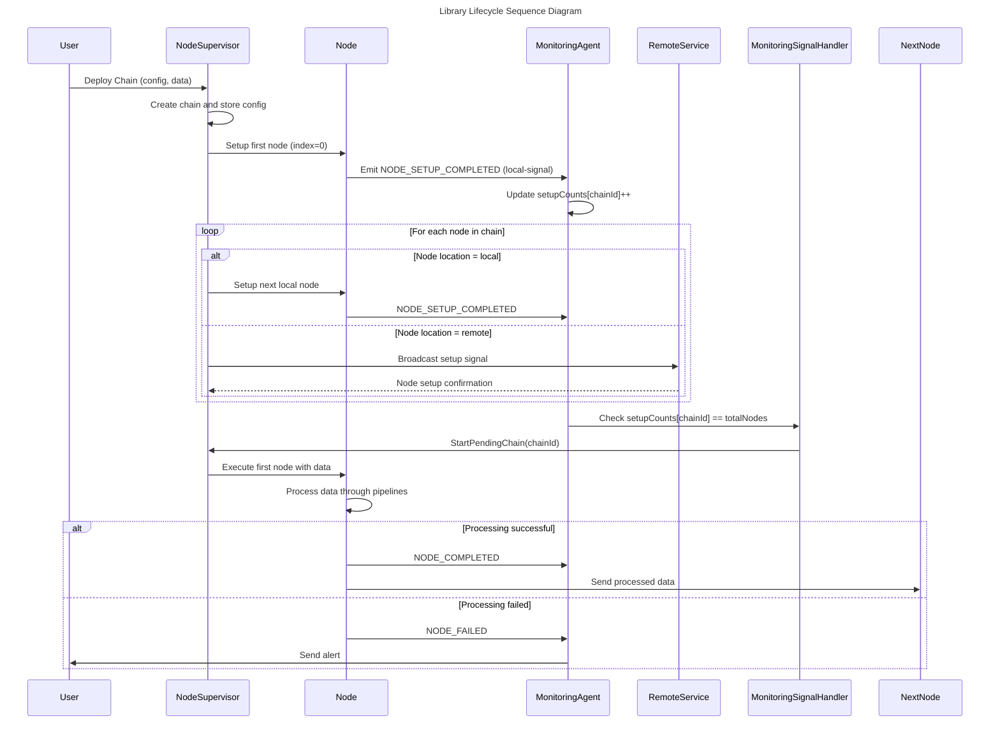
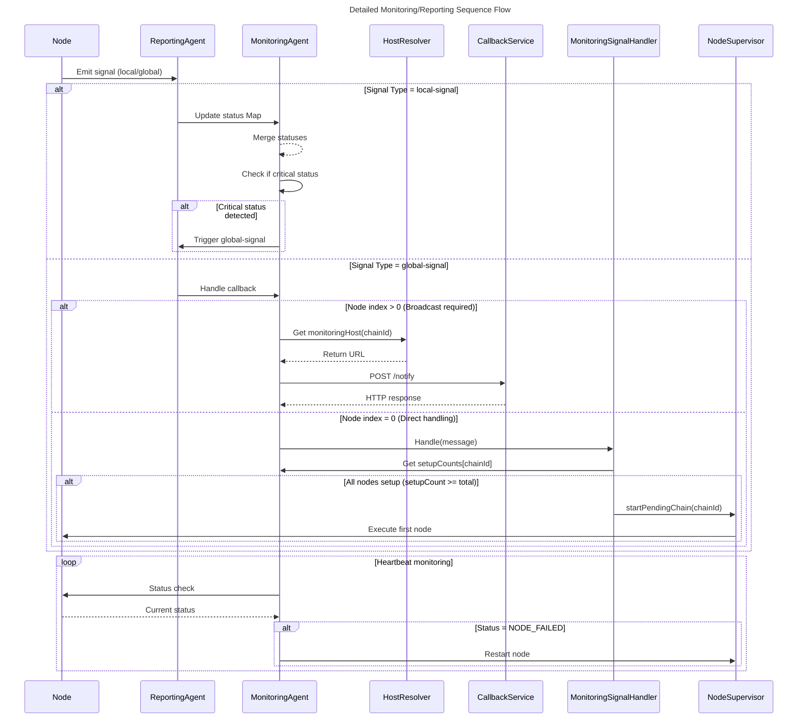
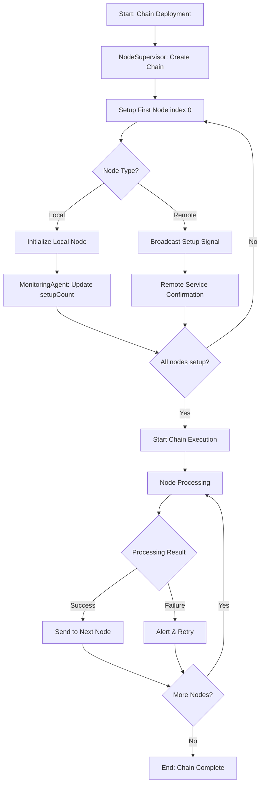
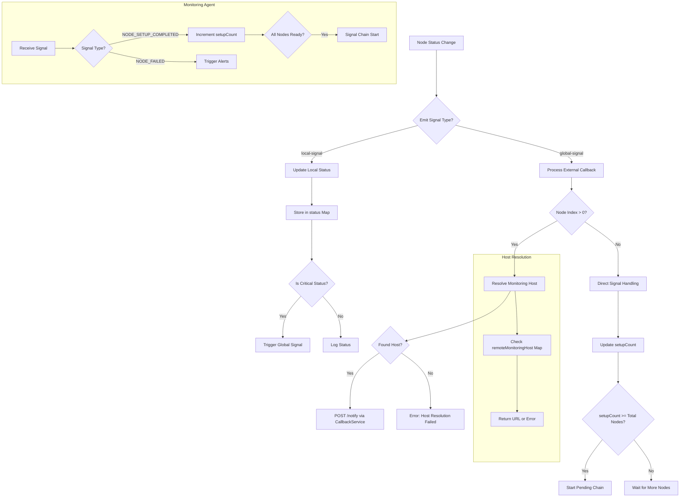

# Library Lifecycle and Monitoring Flow Documentation

## 1. Global Library Lifecycle Sequence Diagram

## 2. Monitoring/Reporting Flow Sequence Diagram

## 3. Global Lifecycle Flowchart

## 4. Monitoring Flowchart

## Key Components Explanation

1. **Node**: The basic processing unit that executes pipelines and emits status signals
2. **ReportingAgent**: Mediator between Nodes and MonitoringAgent
3. **MonitoringAgent**: Central hub for status tracking and decision making
4. **HostResolver**: Resolves monitoring endpoints based on chain ID
5. **Callback Services** (Multiple Purposes):
   - *Reporting Callback* (`reportingCallback`): HTTP service for monitoring notifications
   - *Broadcast Callback* (`broadcastReportingCallback`): Distributed notifications across nodes
   - *Processor Callback* (`ProcessorCallback`): Encapsulates remote services in pipelines
   - *Setup Callback* (`broadcastSetupCallback`): Handles node initialization signals
6. **MonitoringSignalHandler**: Special handler for chain setup completion
7. **NodeSupervisor**: Orchestrates node lifecycle and chain execution

**Critical Decision Points:**
- `index > 0`: Determines if broadcast is needed (non-initiator nodes)
- `setupCount >= total`: Chain start condition check
- `Critical Status`: Determines if escalation is needed
- `Node Type`: Local vs remote handling differentiation

## Callback Services Taxonomy

| Callback Type          | Scope          | Protocol | Responsibility                          | Example Usage             |
|------------------------|----------------|----------|-----------------------------------------|---------------------------|
| ProcessorCallback      | Pipeline level | Any      | Remote service encapsulation            | Data transformation       |
| ReportingCallback      | Monitoring     | HTTP     | Node status notifications               | NODE_FAILED alerts        |
| BroadcastCallback      | Chain          | HTTP     | Cross-node communication                | Setup distribution        |
| SetupCallback          | Initialization | HTTP     | Node configuration broadcasting         | Chain deployment          |
