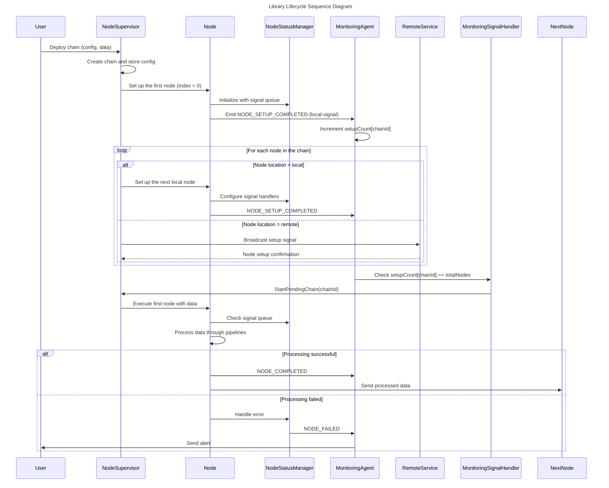
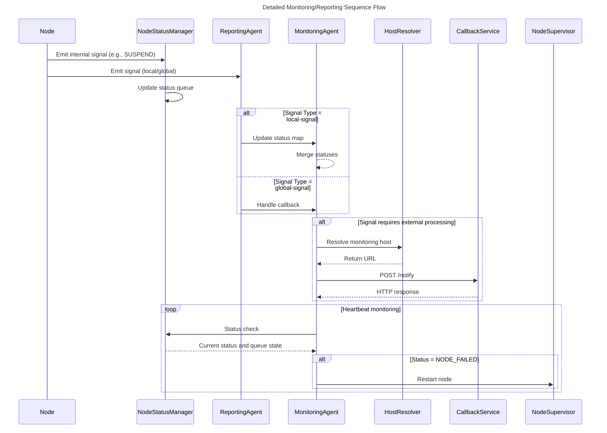
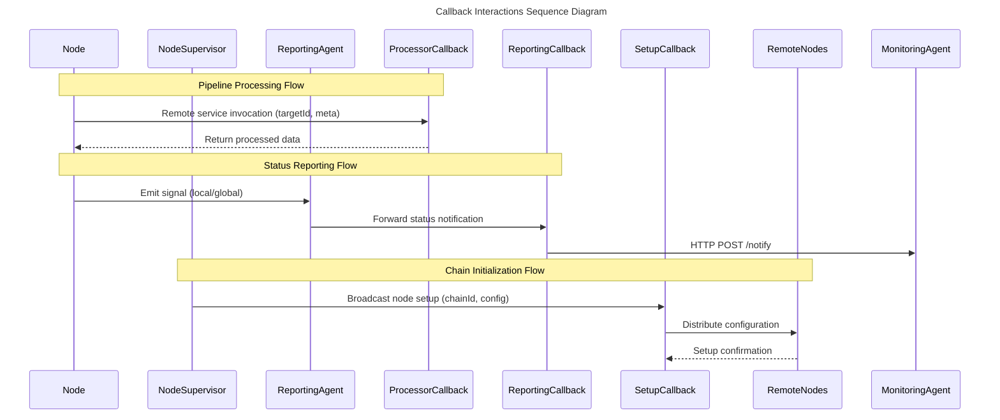
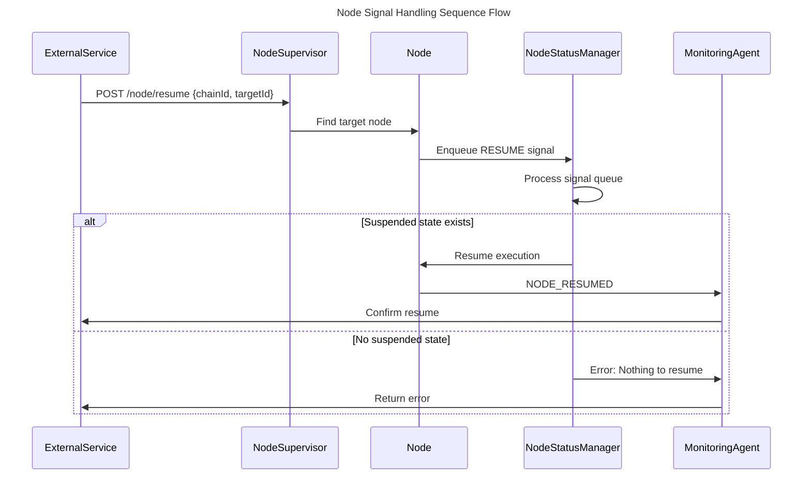
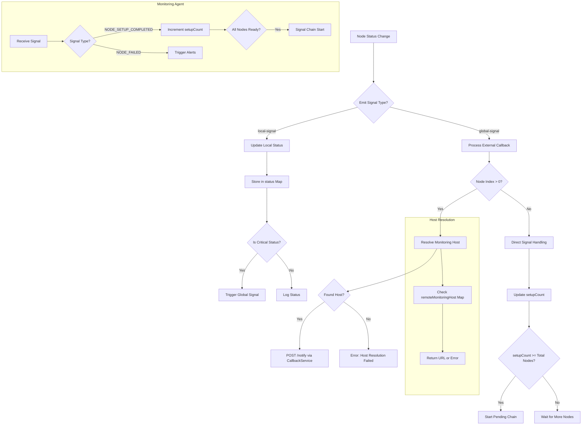

# Library Lifecycle and Monitoring Flow Documentation

## 1. Global Library Lifecycle Sequence Diagram



## 2. Monitoring/Reporting Flow Sequence Diagram



## 2a. Callbacks Flow Sequence Diagram



## 3. Signal Handling Flow



## 4. Global Lifecycle Flowchart

```mermaid
flowchart TD
    A[Start: Chain Deployment] --> B[NodeSupervisor: Create Chain]
    B --> C[Set up the first node (index = 0)]
    C --> D{Node Type?}
    D -->|Local| E[Initialize Local Node]
    D -->|Remote| F[Broadcast Setup Signal]
    
    E --> G[MonitoringAgent: Increment setupCount]
    F --> H[Remote Service Confirmation]
    
    G --> I{All nodes set up?}
    H --> I
    I -->|Yes| J[Start Chain Execution]
    I -->|No| C
    
    J --> K[Node Processing]
    K --> L{Processing Result}
    L -->|Success| M[Send to Next Node]
    L -->|Failure| N[Alert & Retry]
    
    M --> O{More Nodes?}
    N --> O
    O -->|Yes| K
    O -->|No| P[End: Chain Complete]
```

## 5. Monitoring Flowchart



## Key Components Explanation

1. **Node**: The basic processing unit that executes pipelines and emits status signals.
2. **ReportingAgent**: Mediator between nodes and the MonitoringAgent.
3. **MonitoringAgent**: Central hub for status tracking and decision making.
4. **HostResolver**: Resolves monitoring endpoints based on chain ID.
5. **Callback Services** (Multiple Purposes):
   - *Reporting Callback* (`ReportingCallback`): HTTP service for monitoring notifications.
   - *Processor Callback* (`ProcessorCallback`): Encapsulates remote services in pipelines.
   - *Setup Callback* (`SetupCallback`): Handles node initialization signals.
6. **MonitoringSignalHandler**: Special handler for chain setup completion.
7. **NodeSupervisor**: Orchestrates node lifecycle and chain execution.

**Critical Decision Points:**
- `index > 0`: Determines if broadcast is needed (non-initiator nodes).
- `setupCount >= totalNodes`: Chain start condition check.
- `Critical Status`: Determines if escalation is needed.
- `Node Type`: Differentiates local versus remote handling.

## Callback Services Taxonomy

| Callback Type     | Scope          | Protocol | Responsibility                        | Example Usage         |
|-------------------|----------------|----------|---------------------------------------|-----------------------|
| ProcessorCallback | Pipeline level | Any      | Remote service encapsulation          | Data transformation   |
| ReportingCallback | Monitoring     | HTTP     | Node status notifications             | NODE_FAILED alerts    |
| SetupCallback     | Initialization | HTTP     | Node configuration broadcasting       | Chain deployment      |
